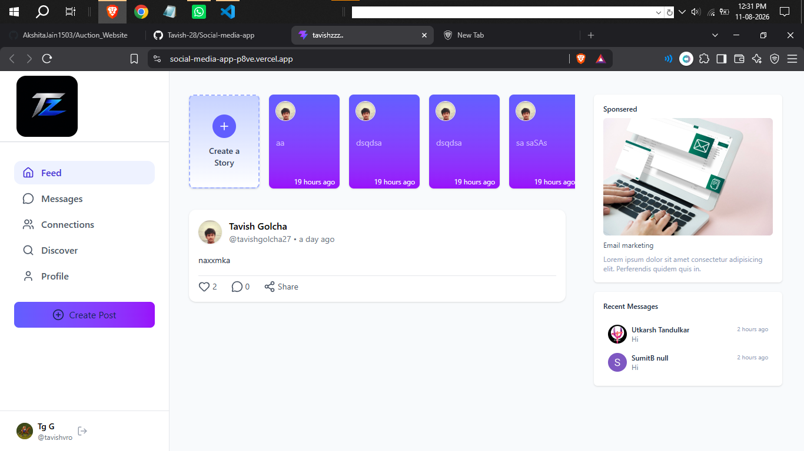
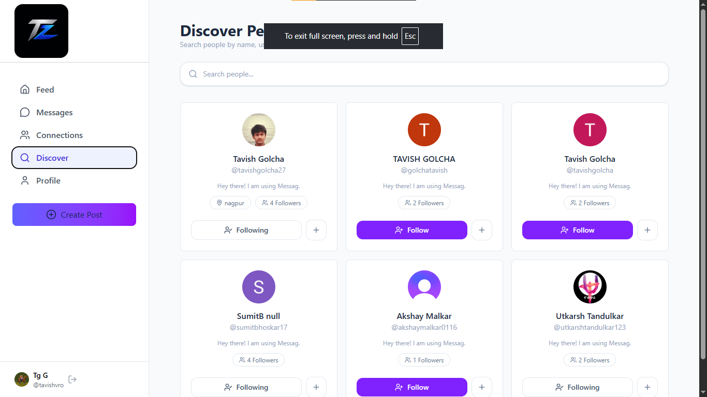
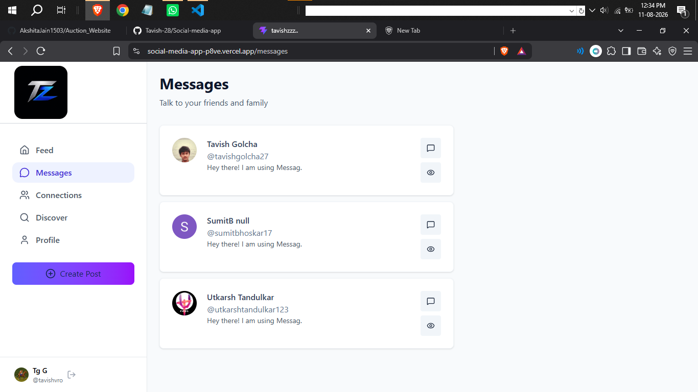
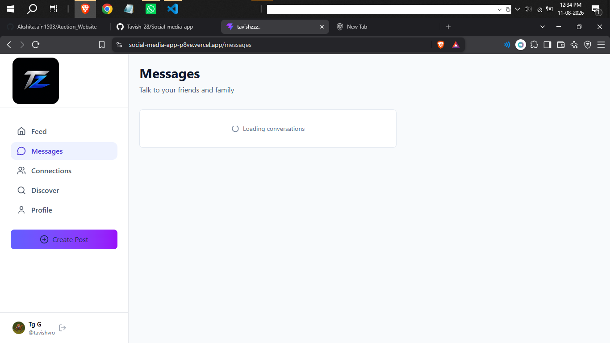
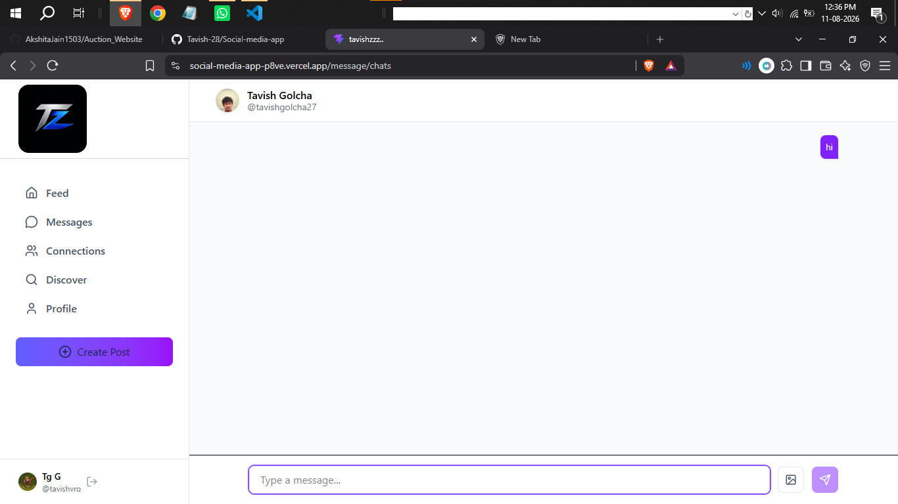
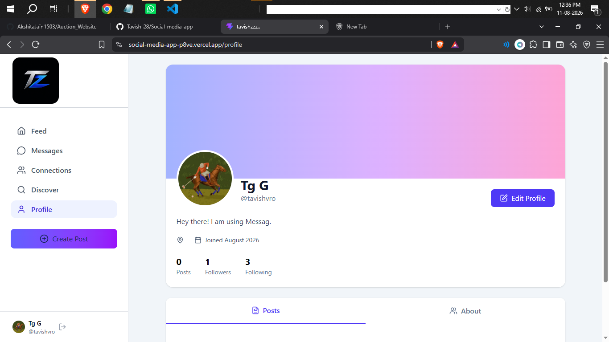
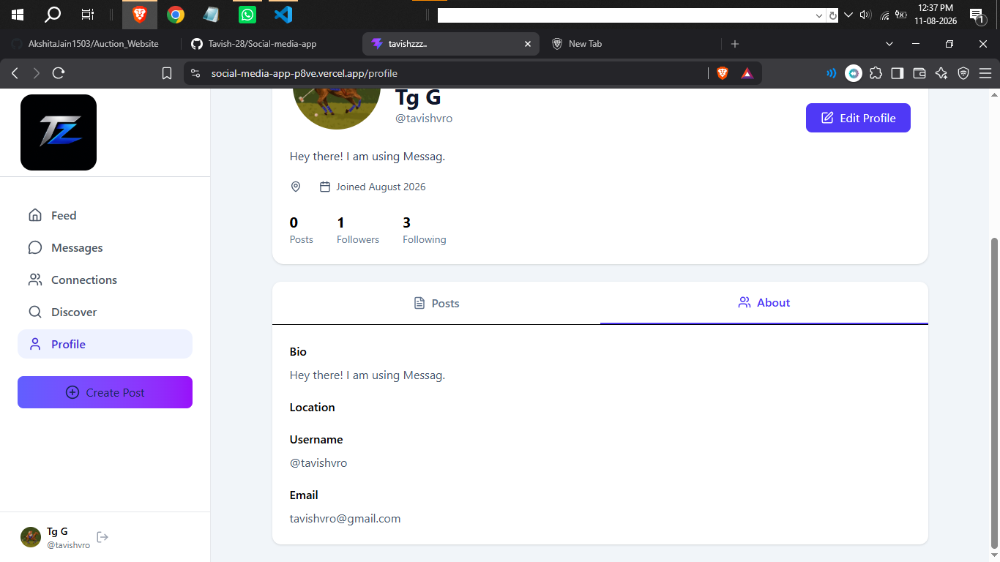
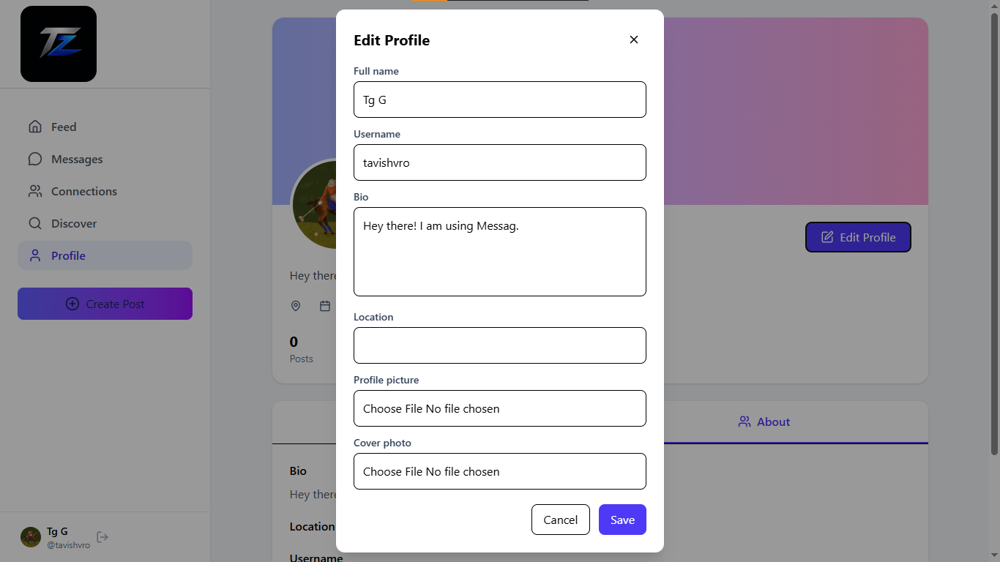

An Social Media app

~ This is an sicial media app
~ Here first you need to sign up (I have used the CLERK for the autentication )
~ After the signup You would see the home-page like this

~Initially there would be no recent messages section Since you have not followed anyone
~Than you need to go to the Discover section you would be seeing a page like this

~After following few people

~ go to messages section it would look like

~Sometimes if the server is slow than it could show the Loading,Like: this

~No need to worry it would be gone once the data is retrieved from the server
~ Click the message icon beside every contact
~you would be directed to a page like

~ In the Profile section you would see

~ You could edit the profile by clicking the "Edit profile " button

