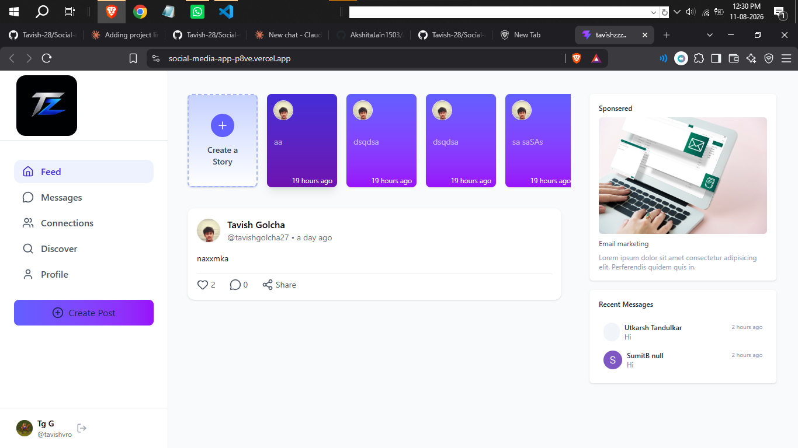
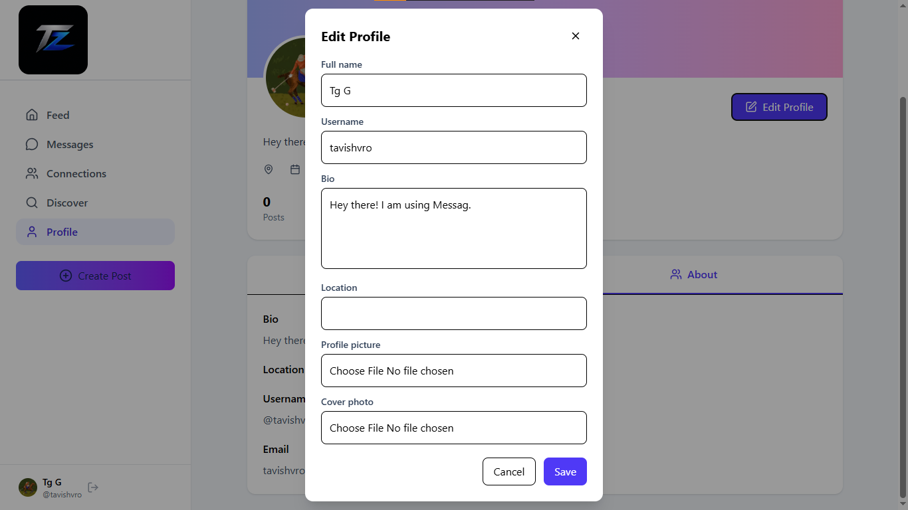

# Social Media App

A full-stack social media application where users can sign up, discover people, follow other users, create posts and stories, send messages, and manage their profile.

The app uses **Clerk** for authentication, **MongoDB** for data storage, **ImageKit** for media uploads, and **Inngest** for background workflows.

## Live Demo

[Click here to view the live app](https://social-media-app-p8ve.vercel.app/)

It will show as a direct clickable link on GitHub:

Click here to view the live app (https://social-media-app-p8ve.vercel.app/)

## Features

- User authentication with Clerk
- Personalized home feed
- Discover and follow users
- Recent messages section
- One-to-one messaging
- Profile view and profile editing
- Post and story support
- Image upload support with ImageKit
- Email/background workflow support with Inngest and SMTP

## Tech Stack

| Area            | Technology                |
| --------------- | ------------------------- |
| Frontend        | React, Vite, Tailwind CSS |
| Backend         | Node.js, Express          |
| Database        | MongoDB, Mongoose         |
| Authentication  | Clerk                     |
| Media Storage   | ImageKit                  |
| Background Jobs | Inngest                   |
| Email           | Nodemailer / SMTP         |

## Screenshots

### Home

After signing up, users land on the home page.



### Discover

Users can discover and follow other people from the Discover section.


### Messages

After following users, recent messages and contacts become available.


### Chat

Click the message icon beside a contact to open the chat page.


### Profile

Users can view and manage their profile information.


### Edit Profile

Users can edit their profile by clicking the **Edit profile** button.



## Local Setup

Follow these steps to run the project on your local system.

### 1. Clone or Open the Project

Open a terminal in the project root:

```powershell
cd "C:\Users\Administrator\Desktop\social media app"
```

### 2. Install Server Dependencies

```powershell
cd server
npm install
```

### 3. Install Client Dependencies

```powershell
cd ..\client
npm install
```

### 4. Configure Server Environment Variables

Create a `.env` file inside the `server` folder:

```env
PORT=4000
FRONTEND_URL=http://localhost:5173

MONGODB_URL=your_mongodb_connection_string
INNGEST_EVENT_KEY=your_inngest_event_key
INNGEST_SIGNING_KEY=your_inngest_signing_key

CLERK_PUBLISHABLE_KEY=your_clerk_publishable_key
CLERK_SECRET_KEY=your_clerk_secret_key

IMAGEKIT_PUBLIC_KEY=your_imagekit_public_key
IMAGEKIT_PRIVATE_KEY=your_imagekit_private_key
IMAGEKIT_URL_ENDPOINT=your_imagekit_url_endpoint

SENDER_EMAIL=your_sender_email
SMTP_USER=your_smtp_user
SMTP_PASS=your_smtp_password
```

### 5. Configure Client Environment Variables

Create a `.env` file inside the `client` folder:

```env
VITE_CLERK_PUBLISHABLE_KEY=your_clerk_publishable_key
VITE_BASEURL=http://localhost:4000
```

## Running the App

Start the backend server:

```powershell
cd server
npm run server
```

The backend runs at:

```text
http://localhost:4000
```

Start the frontend in a second terminal:

```powershell
cd client
npm run dev
```

The frontend runs at:

```text
http://localhost:5173
```

## Project Structure

```text
social media app/
|-- client/      # React frontend
|-- server/      # Express backend
|-- images/      # README screenshots
`-- README.md
```

## Important Notes

- Keep `.env` files private and do not commit them to GitHub.
- Make sure MongoDB is running or your MongoDB Atlas connection string is valid.
- Clerk keys must match the Clerk application used by the frontend and backend.
- If the server is slow, loading states may appear until data is retrieved.
